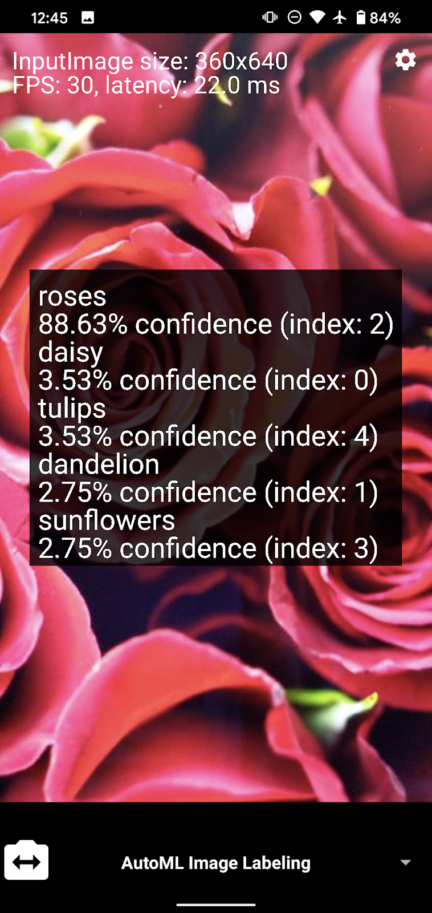

# ML Kit AutoML Remote Model Quickstart Sample App

* [Read more about training an image classification model using AutoML Vision Edge model](https://firebase.google.com/docs/ml/automl-image-labeling)
* [Read more about hosting models with Firebase Model deployment](https://firebase.google.com/docs/ml/manage-hosted-models)

## Introduction

This ML Kit Quickstart App demonstrates how to label images and objects with an
AutoML Vision Edge trained model, and also how to download models that are
hosted within Firebase.

## Feature List
Features that are included in this demo app:

* [Custom Image labeling](https://developers.google.com/ml-kit/vision/image-labeling/custom-models/android) - Label images using a custom AutoML VisionEdge trained model that is downloaded from Firebase.
* [Custom Object Detection and Tracking](https://developers.google.com/ml-kit/vision/object-detection/custom-models/android) - Detect and label object using a custom AutoML VisionEdge trained model that is downloaded from Firebase.

## Getting Started

* In order to setup this app to run, you need to create a Firebase project as
outlined [here](https://firebase.google.com/docs/android/setup).
* Run the sample code on your Android device or emulator
* Try extending the code to add new features and functionality
* Ensure your device is connected to the Internet to download the remote model

## How to use the app
This app supports three usage scenarios: Live Camera, Static Image, and CameraX
enabled live camera.

### Live Camera Scenario
This mode uses the camera preview as input and allows you to label images using
a remotely downloaded AutoML Vision Edge model. There is also a settings page
that allows you to configure several options:

* Camera
    * Preview Size -- Specify the preview size of rear camera manually (Default
    size is chose appropriately based on screen size)
    * Enable live viewport -- Prevent the live camera preview from being blocked
    by API rendering speed.
* AutoML Image Labeling
    * AutoML Remote Model Name -- Allows you to specify an AutoML VisionEdge
    model to remotely download from the Firebase Console

### Static Image Scenario
The static image scenario is identical to the live camera scenario, but instead
relies on images fed into the app through the gallery.

### CameraX Live Preview scenario
The CameraX live preview scenario is very similar to the native live camera
scenario, but instead relies on CameraX live preview instead of the Camera2 live
preview. Note: CameraX is only supported on API level 21+.

## Support

* [Stack Overflow](https://stackoverflow.com/questions/tagged/google-mlkit)

## License

Copyright 2020 Google, Inc.

Licensed to the Apache Software Foundation (ASF) under one or more contributor
license agreements.  See the NOTICE file distributed with this work for
additional information regarding copyright ownership.  The ASF licenses this
file to you under the Apache License, Version 2.0 (the "License"); you may not
use this file except in compliance with the License.  You may obtain a copy of
the License at

  http://www.apache.org/licenses/LICENSE-2.0

Unless required by applicable law or agreed to in writing, software
distributed under the License is distributed on an "AS IS" BASIS, WITHOUT
WARRANTIES OR CONDITIONS OF ANY KIND, either express or implied.  See the
License for the specific language governing permissions and limitations under
the License.
