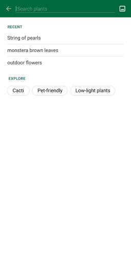
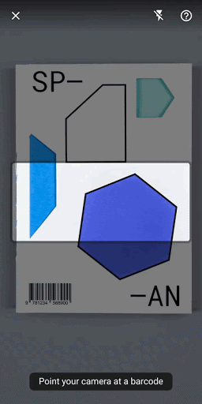

# ML Kit Vision Showcase App with Material Design

This app demonstrates how to build an end-to-end user experience with
[Google ML Kit APIs](https://developers.google.com/ml-kit/guides) and following the
[new Material for ML design guidelines](https://material.io/design/machine-learning/).

The goal of this app is to showcase an ideal ML Kit driven end to end solution for various ML Kit vision APIs and use cases. The following use cases are covered:
* Visual search using the Object Detection & Tracking API - An end to end workflow for object detection and product search
* “Wild Bird” search using the Object Detection & Tracking API - An end to end workflow for object detection and search using a custom TensorFlow Lite model
* Barcode detection - An end to end barcode scanning solution

 

## Steps to run the app

* Clone this repo locally
* Build and run it on an Android device

## How to use the app

This app supports two usage scenarios: Live Camera and Static Image.

### Live Camera scenario

It uses the camera preview as input and contains three workflow: object detection & visual search,
object detection & custom classification, and barcode detection. There's also a Settings page to
allow you to configure several options:
- Camera
  - Preview Size - Specify the preview size of rear camera manually (Default size is chose appropriately based on screen size)
- Object detection
    - Enable Multiple Objects -- Enable multiple objects to be detected at once.
    - Enable classification -- Enable coarse classification
- Product search
    - Enable auto search -- If enabled, search request will be fired automatically once object is detected and confirmed, otherwise a search button will appear to trigger search manually
    - Confirmation time in manual search -- Required time that an manually-detected object needs to be in focus before it is confirmed.
    - Confirmation time in auto search -- Required time that an auto-detected object needs to be in focus before it is confirmed.
- Barcode detection
    - Barcode reticle width -- Size of barcode reticle width relative to the camera preview width
    - Barcode reticle height -- Size of the barcode reticle height relative to the camera preview height
    - Enable Barcode size check -- Will prompt user to "move closer" if the detected barcode is too small
    - Delay loading result -- Simulates a case where the detected barcode requires further processing before displaying the result.

### Static Image scenario

During this scenario, the app will prompt the user to select an image from the “Image Picker” (gallery), detect objects in the selected image, and then perform visual search on those objects. There are well designed UI components (overlay dots, card carousel etc.) to indicate the detected objects and search results.

### Visual Search

Please note that the visual search functionality in this app will not work since there is no real search backend setup for this repository. However, it should be easy to hook up your  own search service (e.g. [Product Search](https://cloud.google.com/vision/product-search/docs)) by only replacing the [SearchEngine](https://github.com/googlesamples/mlkit/blob/master/android/material-showcase/app/src/main/java/com/google/mlkit/md/productsearch/SearchEngine.kt) class implementation.

## License
© Google, 2020. Licensed under an [Apache-2](./LICENSE) license.
