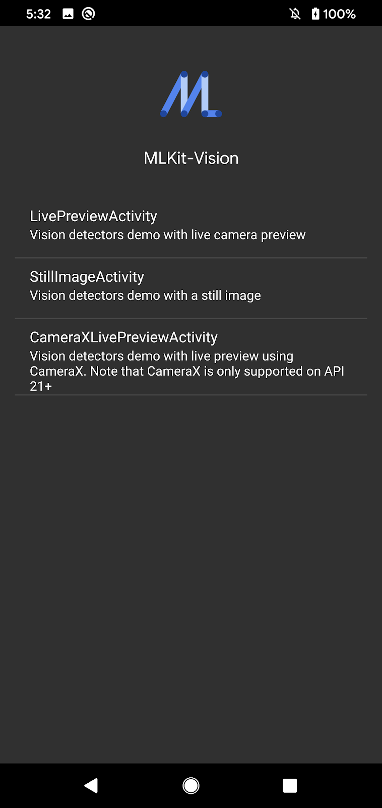
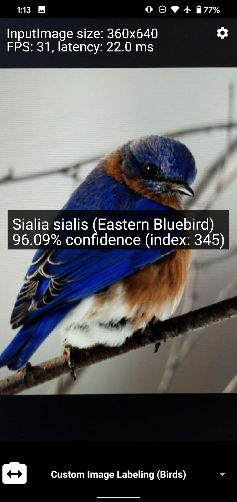
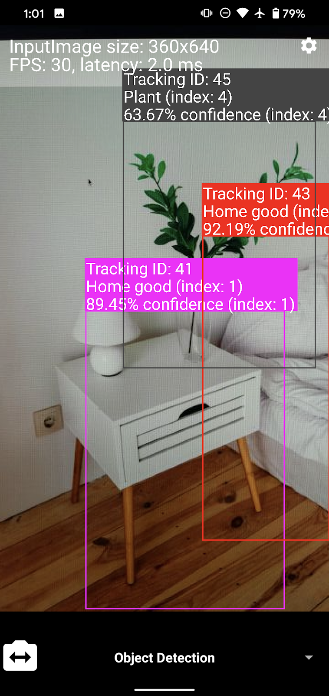

# ML Kit Vision Quickstart Sample App

## Introduction

This ML Kit Quickstart app demonstrates how to use and integrate various vision based ML Kit features into your app.

## Feature List

Features that are included in this Quickstart app:
* [Object Detection](https://developers.google.com/ml-kit/vision/object-detection/android) - Detect, track, and classify objects in real time and static images
* [Face Detection](https://developers.google.com/ml-kit/vision/face-detection/android) - Detect faces in real time and static images
* [Text Recognition](https://developers.google.com/ml-kit/vision/text-recognition/android) - Recognize text in real time and static images
* [Barcode Scanning](https://developers.google.com/ml-kit/vision/barcode-scanning/android)  - Scan barcodes in real time and static images
* [Image Labeling](https://developers.google.com/ml-kit/vision/image-labeling/android) - Label images in real time and static images
* [Custom Image Labeling - Birds](https://developers.google.com/ml-kit/vision/image-labeling/custom-models/android) - Label images of birds with a custom TensorFlow Lite model.
* [Pose Detection](https://developers.google.com/ml-kit/vision/pose-detection/android) - Detect the position of the human body in real time.

  

## Getting Started

* Run the sample code on your Android device or emulator
* Try extending the code to add new features and functionality

## How to use the app

This app supports three usage scenarios: Live Camera, Static Image, and CameraX enabled live camera.

### Live Camera scenario
It uses the camera preview as input and contains these API workflows: Object detection & tracking, Face Detection, Text Recognition, Barcode Scanning, and Image Labeling. There's also a settings page that allows you to configure several options:
* Camera
    * Preview Size - Specify the preview size of rear camera manually (Default size is chose appropriately based on screen size)
    * Enable live viewport - Prevent the live camera preview from being blocked by API rendering speed
* Object detection / Custom Object Detection
    * Enable Multiple Objects -- Enable multiple objects to be detected at once.
    * Enable classification -- Enable coarse classification
* Face Detection
    * Landmark Mode -- Toggle between showing no or all facial landmarks
    * Contour Mode -- Toggle between showing no or all contours
    * Classification Mode -- Toggle between showing no or all classifications (smiling, eyes open/closed)
    * Performance Mode -- Toggle between two operating modes (Fast or Accurate)
    * Face Tracking -- Enable or disable face tracking
    * Minimum Face Size -- Choose the proportion of the head width to the image width
* AutoML Image Labeling
    * AutoML Remote Model Name -- Allows you to specify an AutoML VisionEdge model to remotely download from the Firebase Console
    * AutoML Model Choices -- Toggle between using the remote or local AutoML model.
* Pose Detection
    * Performance Mode -- Allows you to switch between "Fast" and "Accurate" operation mode
    * Show In-Frame Likelihood -- Displays InFrameLikelihood confidence within the app

### Static Image scenario
The static image scenario is identical to the live camera scenario, but instead relies on images fed into the app through the gallery.

### CameraX Live Preview scenario
The CameraX live preview scenario is very similar to the native live camera scenario, but instead relies on CameraX live preview instead of the Camera2 live preview. Note: CameraX is only supported on API level 21+.

## Support

* [Documentation](https://developers.google.com/ml-kit/guides)
* [API Reference](https://developers.google.com/ml-kit/reference/android)
* [Stack Overflow](https://stackoverflow.com/questions/tagged/google-mlkit)

## License

Copyright 2020 Google, Inc.

Licensed to the Apache Software Foundation (ASF) under one or more contributor
license agreements.  See the NOTICE file distributed with this work for
additional information regarding copyright ownership.  The ASF licenses this
file to you under the Apache License, Version 2.0 (the "License"); you may not
use this file except in compliance with the License.  You may obtain a copy of
the License at

  http://www.apache.org/licenses/LICENSE-2.0

Unless required by applicable law or agreed to in writing, software
distributed under the License is distributed on an "AS IS" BASIS, WITHOUT
WARRANTIES OR CONDITIONS OF ANY KIND, either express or implied.  See the
License for the specific language governing permissions and limitations under
the License.
