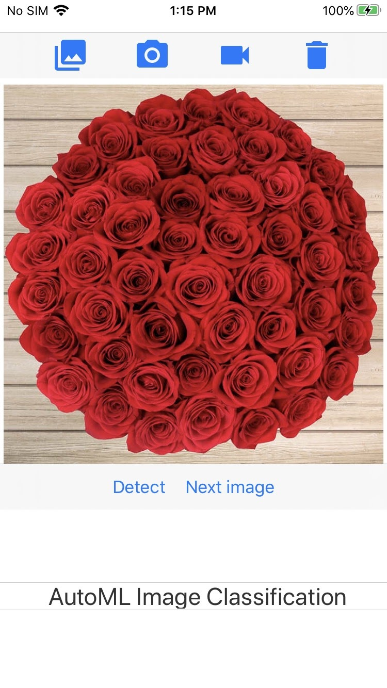

# ML Kit AutoML Remote Model Quickstart Sample App

* [Read more about training an image classification model using AutoML Vision Edge model](https://firebase.google.com/docs/ml/automl-image-labeling)
* [Read more about hosting models with Firebase Model deployment](https://firebase.google.com/docs/ml/manage-hosted-models)

## Introduction

This ML Kit AutoML iOS Quickstart app demonstrates how to label images with an
AutoML Vision Edge trained model, and also how to download models that are
hosted with Firebase.

## Feature List
Features that are included in this demo app:

* [AutoML Image labeling](https://developers.google.com/ml-kit/vision/image-labeling/automl/ios) - Label images using an AutoML VisionEdge trained model

 

## Getting Started

- [Add Firebase to your iOS Project](https://firebase.google.com/docs/ios/setup).
- Run the sample on your iOS device or simulator.
- Choose Photo Library, Photo Camera, or Video Camera to see a demo of labeling
  images using a model trained by AutoML

## How to use the app

This app supports two usage scenarios: Live Camera mode and Static Image mode.

### Live Camera Scenario
This mode uses the camera preview as input and allows you to label images using
a remotely downloaded AutoML Vision Edge model.

### Static Image Scenario
The static image scenario is identical to the live camera scenario, but instead
relies on images fed into the app through the camera roll.

## Support

- [Stack Overflow for ML Kit](https://stackoverflow.com/questions/tagged/google-mlkit)

License
-------

Copyright 2020 Google, Inc.

Licensed to the Apache Software Foundation (ASF) under one or more contributor
license agreements.  See the NOTICE file distributed with this work for
additional information regarding copyright ownership.  The ASF licenses this
file to you under the Apache License, Version 2.0 (the "License"); you may not
use this file except in compliance with the License.  You may obtain a copy of
the License at

  http://www.apache.org/licenses/LICENSE-2.0

Unless required by applicable law or agreed to in writing, software
distributed under the License is distributed on an "AS IS" BASIS, WITHOUT
WARRANTIES OR CONDITIONS OF ANY KIND, either express or implied.  See the
License for the specific language governing permissions and limitations under
the License.
