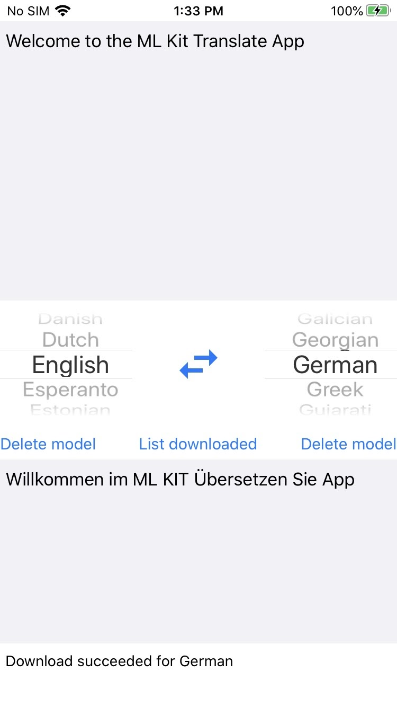

# ML Kit Translate Quickstart Sample App

* [Read more about ML Kit Translate](https://developers.google.com/ml-kit/language/translation)

## Introduction

The ML Kit Translate iOS Quickstart app demonstrates how to use the Translate
feature of ML Kit to translate text in your application.

## Feature List

Features that are included in this demo app:

* [Translate](https://developers.google.com/ml-kit/language/translation/ios) - Translate Text with ML Kit on iOS

## Getting Started

* Run the sample on your iOS device or simulator.
* Type input text and change languages to see translation in action.

## Support

- [Stack Overflow](https://stackoverflow.com/questions/tagged/google-mlkit)

License
-------

Copyright 2020 Google, Inc.

Licensed to the Apache Software Foundation (ASF) under one or more contributor
license agreements.  See the NOTICE file distributed with this work for
additional information regarding copyright ownership.  The ASF licenses this
file to you under the Apache License, Version 2.0 (the "License"); you may not
use this file except in compliance with the License.  You may obtain a copy of
the License at

  http://www.apache.org/licenses/LICENSE-2.0

Unless required by applicable law or agreed to in writing, software
distributed under the License is distributed on an "AS IS" BASIS, WITHOUT
WARRANTIES OR CONDITIONS OF ANY KIND, either express or implied.  See the
License for the specific language governing permissions and limitations under
the License.
